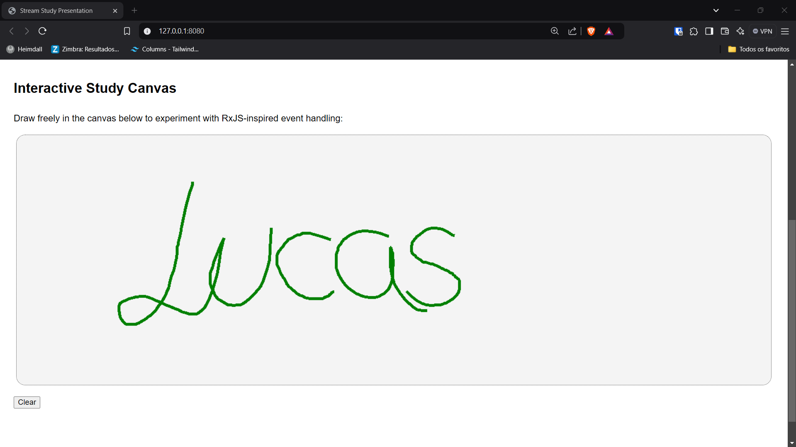

# Stream and RxJS Study Presentation

## Introduction to Streams  

In this study, we explore three types of streams:
- <strong>ReadableStreams</strong> (data sources)
- <strong>TransformStreams</strong> (data manipulation)
- <strong>WritableStreams</strong> (data utilization)

Streams process data asynchronously in "chunks", ensuring real-time processing without blocking. Unlike traditional callback-based models, Node.js streams are promise-based, leveraging a smoother development experience.

Streams are implemented in pipelines, enabling a continuous flow of data. Examples include the <code>fs</code> module for chunk-based file processing and the <code>http</code> module with status code 206 for serving partial content periodically, similar to a socket HTTP connection.

## Recreating RxJS with Native Streams

Inspired by RxJS—a library following the reactive paradigm—we built a study canvas that allows free drawing with mouse or touch inputs. This implementation integrates core operators such as <code>FromEvent</code>, <code>Map</code>, <code>Merge</code>, <code>SwitchMap</code>, and <code>TakeUntil</code>.
The video tutorial by [Erick Wendel](https://www.youtube.com/watch?v=-q5HhC71TBE)
served as the primary reference for this project.

## Interactive Study Canvas

Draw freely in the canvas below to experiment with RxJS-inspired event handling:

## Technologies

&copy; 2024 Study by Lucas Ribeiro Lima. Powered by Streams and RxJS concepts.